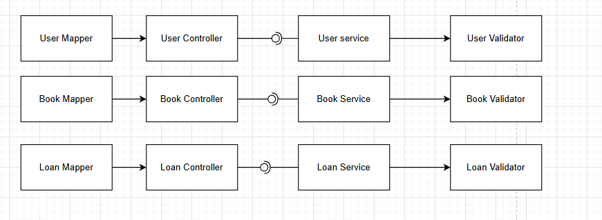

# DOSW-Library

## Descripción del Proyecto

**DOSW-Library** es una solución de backend diseñada para la administración de recursos bibliográficos en entornos académicos. La aplicación gestiona el ciclo de vida de los libros, facilitando procesos de control de inventario, registro de préstamos y gestión de devoluciones. El sistema integra un módulo de seguridad basado en roles para restringir el acceso a operaciones sensibles, garantizando un entorno administrativo confiable y eficiente.

---

## Tecnologías Usadas

* **Java 21**
* **Spring Boot 3.4.3**
* **Spring Data JPA**
* **Spring Security con JWT**
* **MongoDB**
* **Maven**
* **JUnit 5**
* **JaCoCo**

---

## Funcionalidades

* Gestión de catálogo de libros.
* Sistema de préstamos y disponibilidad.
* Seguridad y autorización por roles.
* Documentación de API integrada.

## Diagrama general

Interfaz de Usuario: Punto de interacción final para la gestión de libros, usuarios y préstamos.

Backend API (Núcleo): Procesa la lógica de negocio, validaciones y excepciones del sistema.

Base de Datos: Almacena el inventario, registros de usuarios e historial de transacciones.

Flujo de interacción: Interfaz de Usuario ➔ Backend API ➔ Base de Datos.

## Diagrama de clases

El diagrama de clases centra su lógica en la entidad Loan, la cual vincula a User con Book. Este modelo registra temporalmente el préstamo y utiliza una enumeración de Status para validar rigurosamente el estado del ejemplar (activo o retornado).

## Diagrama especifico

El diagrama organiza la lógica del sistema en una arquitectura de capas: los Mappers transforman los datos de entrada para los Controladores, quienes delegan el procesamiento a los Services. Finalmente, los servicios emplean Validators para garantizar el cumplimiento de las reglas de negocio antes de procesar la información.

Flujo lógico: Mappers ➔ Controladores ➔ Services ➔ Validators.

